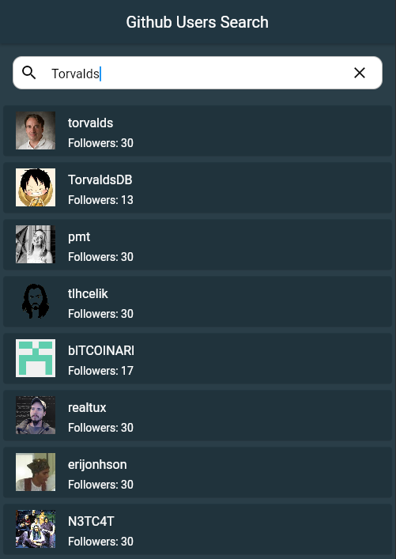
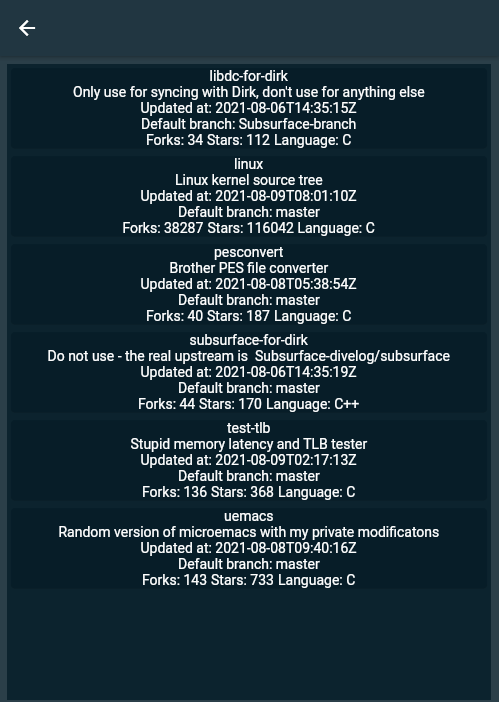

# flutter_github_api
Main screen - users search, searches all users who has querry in username  
Shows cards with avatar, username and number of followers, followers limited to 30 because of API querry restrictions  
  
On click at user card, switches to this user repositories screen and shows name, description, last update, default branch, number of forks, stars and language of repo.  

